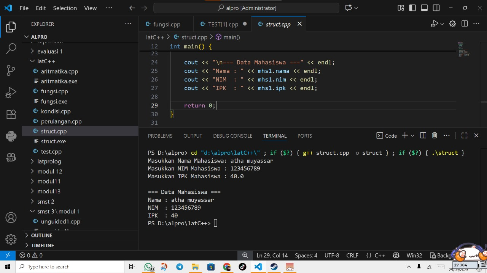
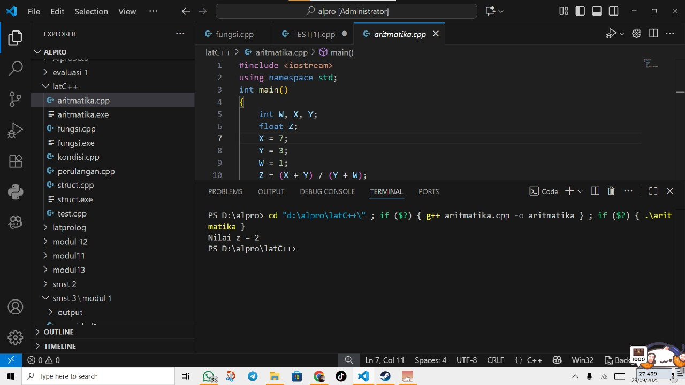
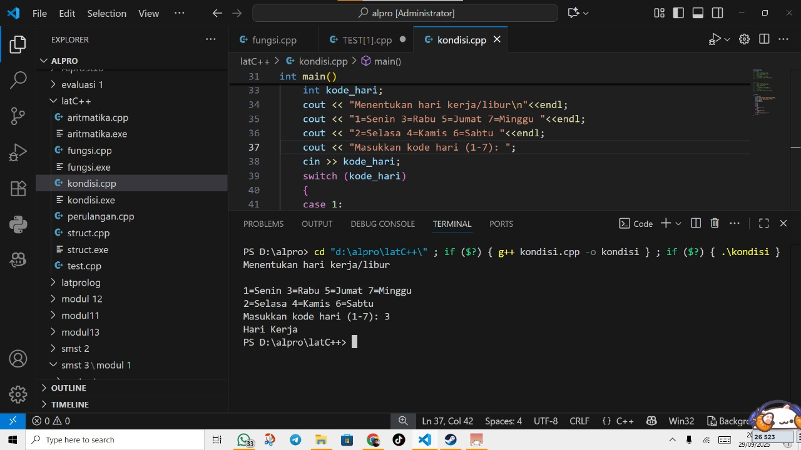
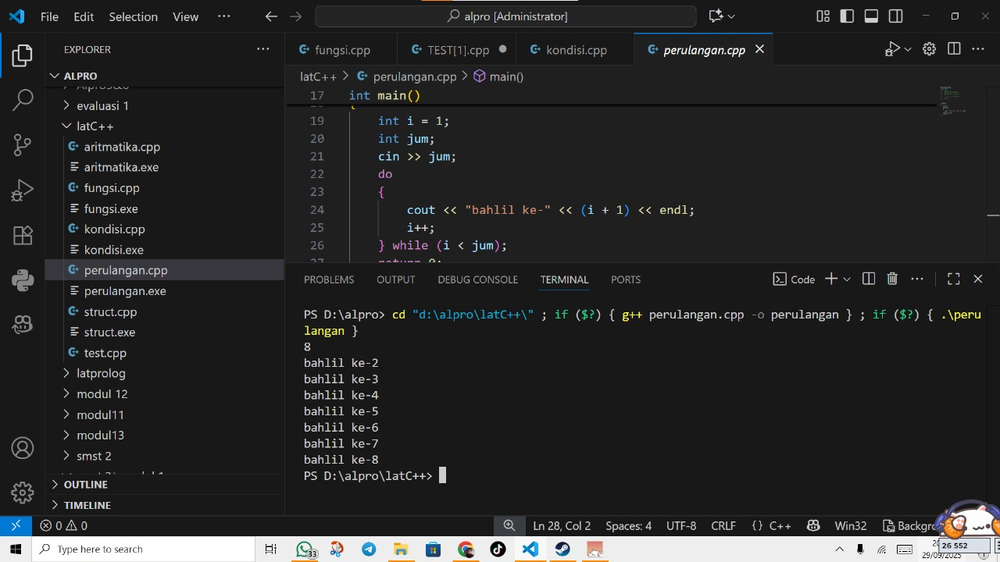
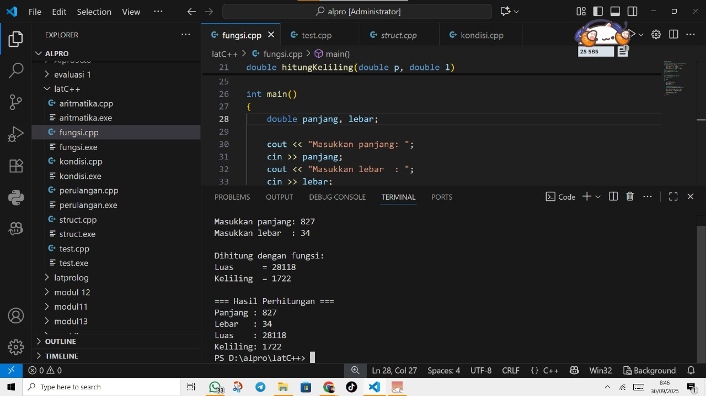
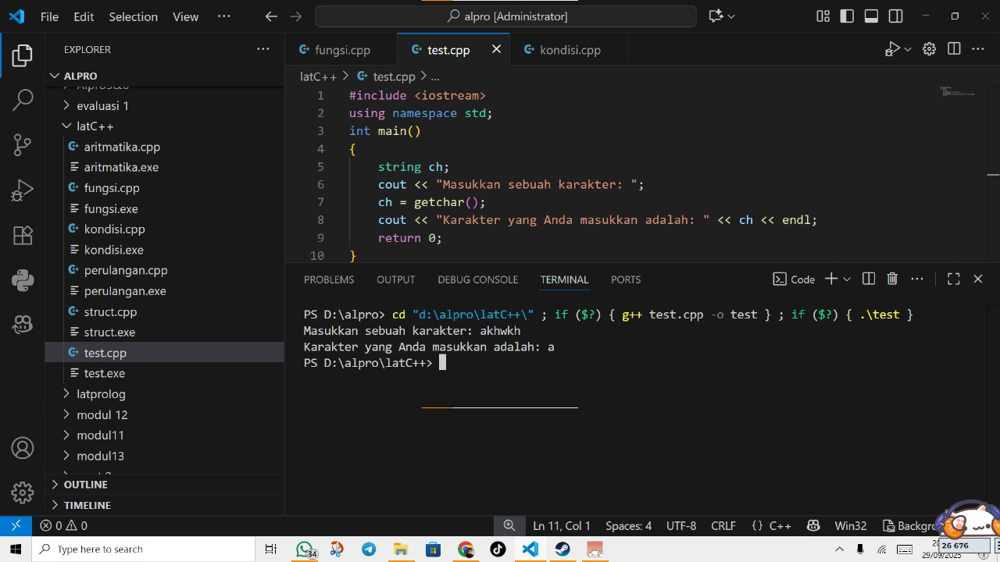

# <h1 align="center">Laporan Praktikum Modul X <br> Nama Modul</h1>
<p align="center">Atha Muyassar - 103112430185</p>

## Dasar Teori

yang panjang dikit

## Guided

### soal 1 (struct)

untuk guided 1 kita membuat sebuah program yang bertujuan untuk menyimpan dan menampilkan data sederhana dengan memanfaatkan struct sebagai struktur data.
kenapa pakai struct, karena untuk data yang punya banyak atribut struct dapat mengemas menjadi satu kesatuan yang membuat data lebih rapi dan mudah di kelola
```go
#include <iostream>
#include <string>
using namespace std;

struct Mahasiswa {
    string nama;
    string nim;
    float ipk;
};

int main() {

    Mahasiswa mhs1;

    cout << "Masukkan Nama Mahasiswa: ";
    getline(cin, mhs1.nama);
    cout << "Masukkan NIM Mahasiswa : ";
    cin >> mhs1.nim;
    cout << "Masukkan IPK Mahasiswa : ";
    cin >> mhs1.ipk;

    cout << "\n=== Data Mahasiswa ===" << endl;
    cout << "Nama : " << mhs1.nama << endl;
    cout << "NIM  : " << mhs1.nim << endl;
    cout << "IPK  : " << mhs1.ipk << endl;

    return 0;
}
```
>Output
>

### soal 2 (aritmatika)

Program ini membuat sebuah operasi aritmetika sederhana, di mana kita menjumlahkan nilai X dan Y, kemudian menjumlahkan juga nilai Y dan W. Setelah itu, hasil penjumlahan pertama dibagi dengan hasil penjumlahan kedua, dan hasil dari pembagian tersebut disimpan ke dalam variabel Z.
```go
#include <iostream>
using namespace std;
int main()
{
    int W, X, Y;
    float Z;
    X = 7;
    Y = 3;
    W = 1;
    Z = (X + Y) / (Y + W);
    cout << "Nilai z = " << Z << endl;
    return 0;
}
```
>Output
>

### soal 3 (kondisi)

Program ini digunakan untuk menentukan apakah suatu hari termasuk hari kerja atau hari libur berdasarkan kode angka yang dimasukkan oleh pengguna. Sistem ini menggunakan pengkondisian switch-case, di mana jika pengguna memasukkan kode angka 1 sampai 5 maka akan ditampilkan "Hari Kerja", sedangkan jika kode yang dimasukkan adalah 6 atau 7 maka akan ditampilkan "Hari Libur". Jika pengguna memasukkan kode selain angka 1 sampai 7, maka sistem akan menampilkan pesan "Kode masukan salah!!!".
```go
#include <iostream>
using namespace std;
int main()
{
    int kode_hari;
    cout << "Menentukan hari kerja/libur\n"<<endl;
    cout << "1=Senin 3=Rabu 5=Jumat 7=Minggu "<<endl;
    cout << "2=Selasa 4=Kamis 6=Sabtu "<<endl;
    cin >> kode_hari;
    switch (kode_hari)
    {
    case 1:
    case 2:
    case 3:
    case 4:
    case 5:
        cout<<"Hari Kerja";
        break;
    case 6:
    case 7:
        cout<<"Hari Libur";
        break;
    default:
        cout<<"Kode masukan salah!!!";
    }
    return 0;
}
```
>Output
>

### soal 4 (perulangan)

Program ini berfungsi untuk menampilkan teks berulang sesuai jumlah yang dimasukkan pengguna dengan menggunakan perulangan do...while. Perulangan ini selalu menjalankan perintah minimal satu kali sebelum memeriksa kondisi.
```go
#include <iostream>
using namespace std;
int main()
{
    int i = 1;
    int jum;
    cin >> jum;
    do
    {
        cout << "bahlil ke-" << (i + 1) << endl;
        i++;
    } while (i < jum);
    return 0;
}
```
>Output
>

### soal 5 (fungsi)

Program ini digunakan untuk menghitung luas dan keliling persegi panjang dengan cara menerima input panjang dan lebar dari pengguna, kemudian menghitungnya melalui fungsi (function), dan menampilkan hasil perhitungan tersebut menggunakan fungsi tampilan.
```go
#include <iostream>
using namespace std;

void tampilkanHasil(double p, double l)
{
    cout << "\n=== Hasil Perhitungan ===" << endl;
    cout << "Panjang : " << p << endl;
    cout << "Lebar   : " << l << endl;
    cout << "Luas    : " << p * l << endl;
    cout << "Keliling: " << 2 * (p + l) << endl;
}

double hitungLuas(double p, double l)
{
    return p * l;
}

double hitungKeliling(double p, double l)
{
    return 2 * (p + l);
}

int main()
{
    double panjang, lebar;

    cout << "Masukkan panjang: ";
    cin >> panjang;
    cout << "Masukkan lebar  : ";
    cin >> lebar;

    double luas = hitungLuas(panjang, lebar);
    double keliling = hitungKeliling(panjang, lebar);

    cout << "\nDihitung dengan fungsi:" << endl;
    cout << "Luas      = " << luas << endl;
    cout << "Keliling  = " << keliling << endl;

    tampilkanHasil(panjang, lebar);

    return 0;
}
```
>Output
>

### soal 6 (test)

Program ini digunakan untuk membaca sebuah karakter dari input pengguna dengan menggunakan fungsi getchar(). Ini berfungsi untuk mengambil satu karakter dari keyboard, di mana jika pengguna mengetik lebih dari satu huruf maka hanya karakter pertama yang akan dibaca, sedangkan sisanya tetap berada di buffer.
```go
#include <iostream>
using namespace std;
int main()
{
    string ch;
    cout << "Masukkan sebuah karakter: ";
    ch = getchar();
    cout << "Karakter yang Anda masukkan adalah: " << ch << endl;
    return 0;
}
```
>Output
>

## Unguided

### Soal 1

Buatlah program yang menerima input-an dua buah bilangan betipe float, kemudian memberikan output-an hasil penjumlahan, pengurangan, perkalian, dan pembagian dari dua bilangan tersebut.

```go
#include <iostream>
using namespace std;

int main() {
    float a,b;
    cout << "input bilangan desimal pertama : ";
    cin >> a;
    cout << "input bilangan desimal kedua   : ";
    cin >> b;
    
    cout << "hasil penjumlahan dari  " << a << " + " << b << " = " << a+b << endl;
    cout << "hasil pengurangan dari  " << a << " - " << b << " = " << a-b << endl;
    cout << "hasil perkalian dari  " << a << " x " << b << " = " << a*b << endl;
    
    if (b != 0)
        cout << "hasil pembagian dari  " << a << " : " << b << " = " << a/b << endl;
    else
        cout << "tidak ada jawaban" << endl;
    return 0;
}
```

> Output
> 

Penjelasan ttg kode kalian disini

### Soal 2

Buatlah sebuah program yang menerima masukan angka dan mengeluarkan output nilai angka tersebut dalam bentuk tulisan. Angka yang akan di-input-kan user adalah bilangan bulat positif mulai dari 0 s.d 100
contoh:
79: tujuh puluh Sembilan

```go
#include <iostream>
using namespace std;

string satuan[] = {"nol", "satu", "dua", "tiga", "empat", "lima", "enam", "tujuh", "delapan", "sembilan"};
string belasan[] = {"sepuluh", "sebelas", "dua belas", "tiga belas", "empat belas", "lima belas", "enam belas", "tujuh belas", "delapan belas", "sembilan belas"};
string puluhan[] = {"", "", "dua puluh", "tiga puluh", "empat puluh", "lima puluh", "enam puluh", "tujuh puluh", "delapan puluh", "sembilan puluh"};

int main() {
    int angka;

    cout << "ini adalah program membaca angka positif dari 0 sampai 100" << endl;
    cout << "masukan angka yang di inginkan:";
    cin >> angka;

    string output;
    if (angka < 0){
        output = "wahh kekecilan bang";
    } else if (angka < 10) {
        output = satuan[angka];    
    } else if (angka < 20) {
        output = belasan[angka - 10];    
    } else if (angka < 100) {
        int puluh = angka / 10;
        int satu = angka % 10;
        output = puluhan[puluh];
        if (satu != 0) {
            output += " " + satuan[satu];
        }        
    } else if (angka == 100) {
        output = "seratus";    
    } else {
        output = "angkanya kegedean bang";
    }

    if (angka > 100 || angka < 0){
        cout << output << endl;
    } else {
        cout << angka << " dibaca " << output << endl;
    }

    return 0;
    
}
```

> Output
> 

penjelasan kode

### Soal 3

Buatlah program yang dapat memberikan input dan output sbb.
>

```go
#include <iostream>
using namespace std;

int main(){
    int n;
    cout << "masukan angka: ";
    cin >> n;
    
    cout << "hasilnya adalah \n";
    for (int i = n; i >= 1; i--){
        
        for (int s = 0; s < n-i; s++){
        cout << " ";
        }
        
        for (int j = i; j >= 1; j--) cout << j;
        cout << " * ";
        for (int j = 1; j <= i; j++) cout << j;
        cout << endl;
    }
    return 0;
}
```

> Output
> 

penjelasan kode

## Referensi

1. https://en.wikipedia.org/wiki/Data_structure (diakses blablabla)
