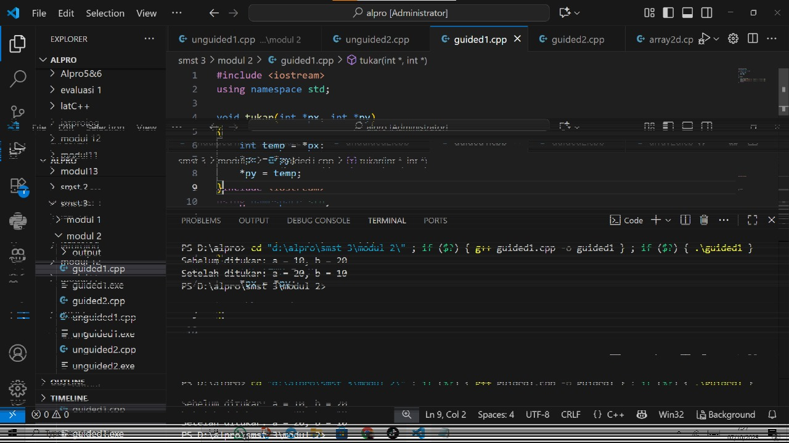
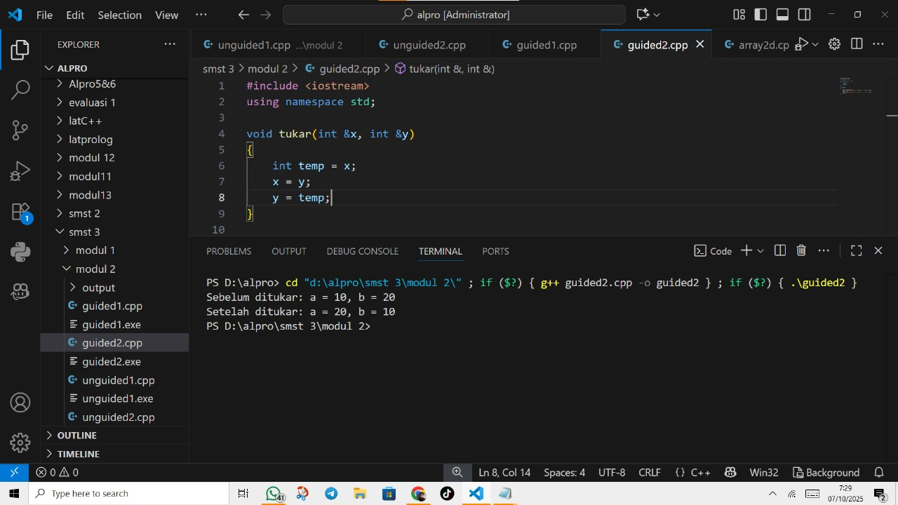

# <h1 align="center">Laporan Praktikum Modul 2 <br> Pengenalan C++ Bagian 2 </h1>
<p align="center">Atha Muyassar - 103112430185</p>

## Dasar Teori

Bahasa C++ adalah bahasa tingkat tinggi yang di kembangkan dari bahasa C. C++ terdiri atas preprocessor directive seperti #include <iostream> untuk memanggil pustaka dan fungsi main() sebagai titik awal eksekusi program. C++ juga menyediakan beberapa tipe data seperti int, char, float, double, string, dan bool. untuk input dan output C++ menggunakan cin(input) dan cout(output) yang dimana perlu menggunakan operator >> untuk membaca data dan << untuk menmpilkan data. Ada juga struktur kontrol seperti if, if-else, switch-case, for, while, dan do-while. ada juga kontrol alur khusus seperti break dan continue.

## Guided

### soal 1 ()

```go

```
>Output
>

### soal 2 ()

```go

```
>Output
>

### soal 3 ()

```go

```
>Output
>

### soal 4 ()

```go

```
>Output
>

### soal 5 (fungsi)

```go

```
>Output
>

### soal 6 ()

```go

```
>Output
>

## Unguided

### Soal 1
Buatlah sebuah program untuk melakukan transpose pada sebuah matriks persegi berukuran 3x3. Operasi transpose adalah mengubah baris menjadi kolom dan sebaliknya. Inisialisasi matriks awal di dalam kode, kemudian buat logika untuk melakukan transpose dan simpan hasilnya ke dalam matriks baru. Terakhir, tampilkan matriks awal dan matriks hasil transpose.
Contoh Output:

Matriks Awal:        Matriks Hasil Transpose:
> |1 2 3|              |1 4 7|
> |4 5 6|              |2 5 8|
> |7 8 9|              |3 6 9|

```go

```

> Output
> 

Program ini digunakan untuk melakukan operasi aritmatika dasar pada dua bilangan desimal yang dimasukan, sistem ini juga menggunakan pengkondisian if untuk memastikan bahwa operasi pembagian hanya di lakukan jika b tidak sama dengan nol.

### Soal 2

```go

```

> Output
> 

Program ini digunakan untuk membaca angka dari 0 - 100 dalam bahasa indonesia, pertama program ini menyiapkan tiga array string yaitu satuan (0-9), belasan (10-19), lalu puluhan (kelipatan 10). setelah itu pengguna diminta untuk memasukan angka dan program akan memeriksa angka tersebut dengan struktur pengkondisian. jika angka kurang dari 0 tampilkan angka terlalu kecil, jika angka kurang dari 10 program mengambil kata dari array satuan, jika angka antara 10 - 19 program mengambil angka dari array belasan, untuk angka 20 - 99 program memecah angka menjadi puluhan dan satuan lalu menyusunnya menjadi teks, jika angka sama dengan 100 maka program menuliskan seratus, dan jika angka lebih besar dari 100 program menampilkan pesan angkanya terlalu besar.

## Referensi

1. https://www.w3schools.com/cpp/default.asp
2. https://www.belajarcpp.com/tutorial/cpp/
3. https://www.petanikode.com/cpp-windows/
4. https://youtube.com/playlist?list=PLZS-MHyEIRo4Ze0bbGB1WKBSNMPzi-eWI&si=1oSxwc95gRfbVdbu
5. 
