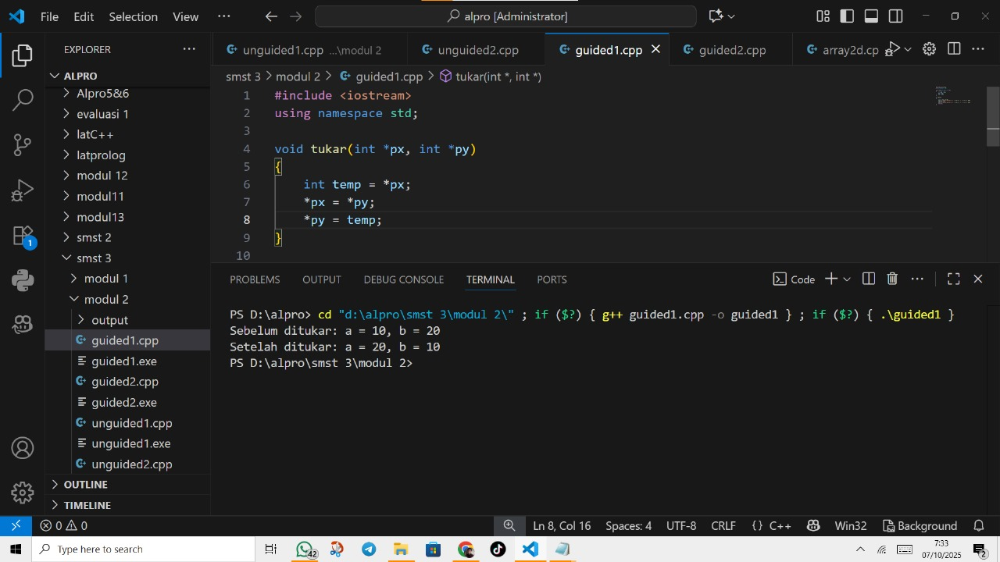

# <h1 align="center">Laporan Praktikum Modul 2 <br> Pengenalan C++ Bagian 2 </h1>
<p align="center">Atha Muyassar - 103112430185</p>

## Dasar Teori

Bahasa C++ adalah bahasa tingkat tinggi yang di kembangkan dari bahasa C. C++ terdiri atas preprocessor directive seperti #include <iostream> untuk memanggil pustaka dan fungsi main() sebagai titik awal eksekusi program. C++ juga menyediakan beberapa tipe data seperti int, char, float, double, string, dan bool. untuk input dan output C++ menggunakan cin(input) dan cout(output) yang dimana perlu menggunakan operator >> untuk membaca data dan << untuk menmpilkan data. Ada juga struktur kontrol seperti if, if-else, switch-case, for, while, dan do-while. ada juga kontrol alur khusus seperti break dan continue.

## Guided

### soal 1 ()

```go

```
>Output
>

### soal 2 ()

```go

```
>Output
>


## Unguided

### Soal 1
Buatlah sebuah program untuk melakukan transpose pada sebuah matriks persegi berukuran 3x3. Operasi transpose adalah mengubah baris menjadi kolom dan sebaliknya. Inisialisasi matriks awal di dalam kode, kemudian buat logika untuk melakukan transpose dan simpan hasilnya ke dalam matriks baru. Terakhir, tampilkan matriks awal dan matriks hasil transpose.
Contoh Output:
>

```go
#include <iostream>
using namespace std;

int main() {
    int matriks_awal[3][3] = {
        {1, 2, 3},
        {4, 5, 6},
        {7, 8, 9} };
    
    int matriks_transpose[3][3];

    for (int i = 0; i < 3; i++) {
        for (int j = 0; j < 3; j++) {
            matriks_transpose[j][i] = matriks_awal[i][j];
        }
    }

    cout << "matriks awal adalah :" << endl;
    for (int i = 0; i < 3; i++) {
        for (int j = 0; j < 3; j++) {
            cout << matriks_awal[i][j] << " ";
        }
        cout << endl;
    }

    cout << "\nsetelah di transpose menjadi :" << endl;
    for (int i = 0; i < 3; i++) {
        for (int j = 0; j < 3; j++) {
            cout << matriks_transpose[i][j] << " ";
        }
        cout << endl;
    }

    return 0;
}
```

> Output
> 

### Soal 2
Buatlah program yang menunjukkan penggunaan call by reference. Buat sebuah prosedur bernama kuadratkan yang menerima satu parameter integer secara referensi (&). Prosedur ini akan mengubah nilai asli variabel yang dilewatkan dengan nilai kuadratnya. Tampilkan nilai variabel di main() sebelum dan sesudah memanggil prosedur untuk membuktikan perubahannya. 

Contoh Output:

Nilai awal: 5

Nilai setelah dikuadratkan: 25
```go
#include <iostream>
using namespace std;

void kuadratkan(int &n) {
    n = n * n;
}

int main() {
    int nilai;
    cout << "masukan angka: ";
    cin >> nilai;
    cout << "ini angka " << nilai << endl;
    kuadratkan(nilai);
    cout << "setelah dikuadratkan hasilnya menjadi " << nilai << endl;
    return 0;
}
```

> Output
> 

## Referensi

1. https://www.w3schools.com/cpp/default.asp
2. https://www.belajarcpp.com/tutorial/cpp/
3. https://www.petanikode.com/cpp-windows/
4. https://youtube.com/playlist?list=PLZS-MHyEIRo4Ze0bbGB1WKBSNMPzi-eWI&si=1oSxwc95gRfbVdbu
5. 
