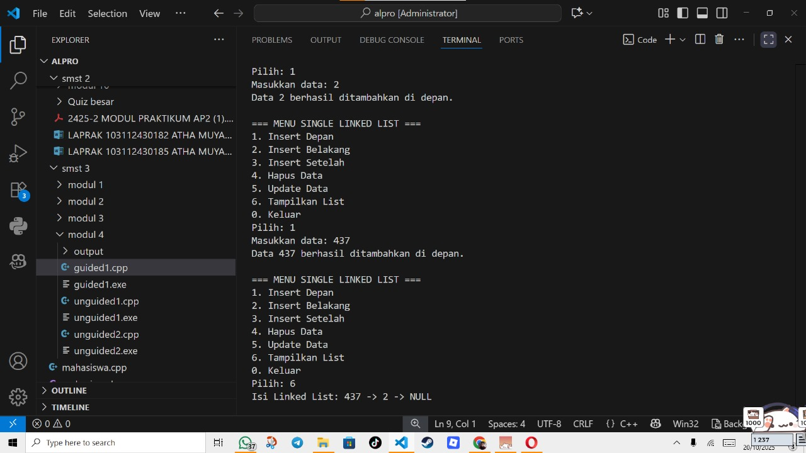
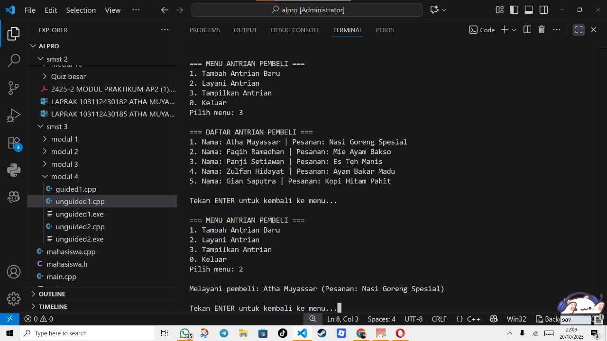
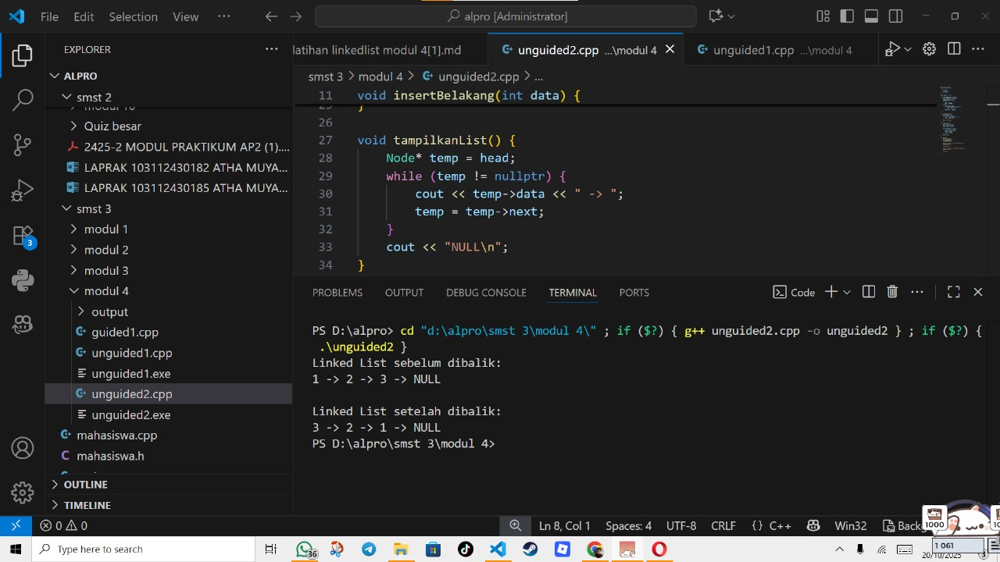

# <h1 align="center">Laporan Praktikum Modul 4 <br> Linked List bagian 1 </h1>
<p align="center">Atha Muyassar - 103112430185</p>

## Dasar Teori
Berlandaskan konsep struktur data Linked List, yaitu struktur data dinamis yang terdiri dari sekumpulan elemen bernama node yang saling terhubung melalui pointer. Setiap node terdiri atas dua bagian, yaitu data yang menyimpan nilai dan pointer yang menunjuk ke node berikutnya, dengan node terakhir menunjuk ke NULL. Berbeda dengan array yang memiliki ukuran tetap dan tersimpan berurutan di memori, Linked List bersifat fleksibel karena dapat bertambah atau berkurang selama program berjalan. Dalam implementasinya, terdapat berbagai operasi seperti penambahan data di depan, belakang, atau setelah node tertentu, penghapusan node berdasarkan data, pembaruan data, serta penelusuran seluruh isi list. Struktur ini juga dapat digunakan untuk membentuk antrian (queue) yang bekerja dengan prinsip FIFO (First In, First Out), di mana data pertama yang masuk akan menjadi data pertama yang keluar, dengan pointer front dan rear digunakan untuk mengatur posisi antrian. Selain itu, dilakukan juga operasi pembalikan urutan (reverse) pada Linked List menggunakan tiga pointer bantu (prev, current, dan next) untuk mengubah arah hubungan antar node. Secara keseluruhan, teori ini menekankan pemahaman tentang manipulasi pointer dalam struktur data dinamis, yang menjadi dasar penting dalam pengembangan struktur data lanjutan seperti stack, queue, tree, dan graph.

## Guided

### soal 1

Program ini memungkinkan pengguna untuk menambahkan, menghapus, memperbarui, dan menampilkan data yang tersimpan dalam rangkaian node yang saling terhubung secara sekuensial melalui pointer. Setiap node terdiri dari dua bagian utama, yaitu data yang menyimpan nilai masukan pengguna dan pointer next yang menunjuk ke node berikutnya. Melalui menu interaktif, pengguna dapat melakukan berbagai operasi seperti menambah node di depan atau di belakang, menyisipkan node setelah nilai tertentu, menghapus node berdasarkan nilai data, memperbarui data lama menjadi baru, serta menampilkan seluruh isi list.
```go
#include <iostream>
using namespace std;

// Struktur Node
struct Node {
    int data;
    Node* next;
};

// Pointer awal
Node* head = nullptr;

// Fungsi membuat node baru
Node* createNode(int data) {
    Node* newNode = new Node();
    newNode->data = data;
    newNode->next = nullptr;
    return newNode;
}

// ========== INSERT DEPAN ==========
void insertDepan(int data) {
    Node* newNode = createNode(data);
    newNode->next = head;
    head = newNode;
    cout << "Data " << data << " berhasil ditambahkan di depan.\n";
}

// ========== INSERT BELAKANG ==========
void insertBelakang(int data) {
    Node* newNode = createNode(data);
    if (head == nullptr) {
        head = newNode;
    } else {
        Node* temp = head;
        while (temp->next != nullptr) {
            temp = temp->next;
        }
        temp->next = newNode;
    }
    cout << "Data " << data << " berhasil ditambahkan di belakang.\n";
}

// ========== INSERT SETELAH ==========
void insertSetelah(int target, int dataBaru) {
    Node* temp = head;
    while (temp != nullptr && temp->data != target) {
        temp = temp->next;
    }

    if (temp == nullptr) {
        cout << "Data " << target << " tidak ditemukan!\n";
    } else {
        Node* newNode = createNode(dataBaru);
        newNode->next = temp->next;
        temp->next = newNode;
        cout << "Data " << dataBaru << " berhasil disisipkan setelah " << target << ".\n";
    }
}

// ========== HAPUS NODE ==========
void hapusNode(int data) {
    if (head == nullptr) {
        cout << "List kosong!\n";
        return;
    }

    Node* temp = head;
    Node* prev = nullptr;

    if (temp != nullptr && temp->data == data) {
        head = temp->next;
        delete temp;
        cout << "Data " << data << " berhasil dihapus.\n";
        return;
    }

    while (temp != nullptr && temp->data != data) {
        prev = temp;
        temp = temp->next;
    }

    if (temp == nullptr) {
        cout << "Data " << data << " tidak ditemukan!\n";
        return;
    }

    prev->next = temp->next;
    delete temp;
    cout << "Data " << data << " berhasil dihapus.\n";
}

// ========== UPDATE NODE ==========
void updateNode(int dataLama, int dataBaru) {
    Node* temp = head;
    while (temp != nullptr && temp->data != dataLama) {
        temp = temp->next;
    }

    if (temp == nullptr) {
        cout << "Data " << dataLama << " tidak ditemukan!\n";
    } else {
        temp->data = dataBaru;
        cout << "Data " << dataLama << " berhasil diupdate menjadi " << dataBaru << ".\n";
    }
}

// ========== TAMPILKAN LIST ==========
void tampilkanList() {
    if (head == nullptr) {
        cout << "List kosong!\n";
        return;
    }

    Node* temp = head;
    cout << "Isi Linked List: ";
    while (temp != nullptr) {
        cout << temp->data << " -> ";
        temp = temp->next;
    }
    cout << "NULL\n";
}

// ========== MAIN PROGRAM ==========
int main() {
    int pilihan, data, target, dataBaru;

    do {
        cout << "\n=== MENU SINGLE LINKED LIST ===\n";
        cout << "1. Insert Depan\n";
        cout << "2. Insert Belakang\n";
        cout << "3. Insert Setelah\n";
        cout << "4. Hapus Data\n";
        cout << "5. Update Data\n";
        cout << "6. Tampilkan List\n";
        cout << "0. Keluar\n";
        cout << "Pilih: ";
        cin >> pilihan;

        switch (pilihan) {
            case 1:
                cout << "Masukkan data: ";
                cin >> data;
                insertDepan(data);
                break;
            case 2:
                cout << "Masukkan data: ";
                cin >> data;
                insertBelakang(data);
                break;
            case 3:
                cout << "Masukkan data target: ";
                cin >> target;
                cout << "Masukkan data baru: ";
                cin >> dataBaru;
                insertSetelah(target, dataBaru);
                break;
            case 4:
                cout << "Masukkan data yang ingin dihapus: ";
                cin >> data;
                hapusNode(data);
                break;
            case 5:
                cout << "Masukkan data lama: ";
                cin >> data;
                cout << "Masukkan data baru: ";
                cin >> dataBaru;
                updateNode(data, dataBaru);
                break;
            case 6:
                tampilkanList();
                break;
            case 0:
                cout << "Program selesai.\n";
                break;
            default:
                cout << "Pilihan tidak valid!\n";
        }
    } while (pilihan != 0);

    return 0;
}
```

>Output
>

## Unguided

### Soal 1
buatlah single linked list untuk Antrian yang menyimpan data pembeli( nama dan pesanan). program memiliki beberapa menu seperti tambah antrian,  layani antrian(hapus), dan tampilkan antrian. \*antrian pertama harus yang pertama dilayani

```go
#include <iostream>
using namespace std;

struct Node {
    char nama[50];
    char pesanan[50];
    Node* next;
};

Node* front = nullptr;
Node* rear = nullptr;

void tambahAntrian(const char nama[], const char pesanan[]) {
    Node* newNode = new Node();
    int i = 0;
    while (nama[i] != '\0') { newNode->nama[i] = nama[i]; i++; }
    newNode->nama[i] = '\0';
    i = 0;
    while (pesanan[i] != '\0') { newNode->pesanan[i] = pesanan[i]; i++; }
    newNode->pesanan[i] = '\0';
    newNode->next = nullptr;

    if (rear == nullptr) {
        front = rear = newNode;
    } else {
        rear->next = newNode;
        rear = newNode;
    }
}

void layaniAntrian() {
    if (front == nullptr) {
        cout << "\nAntrian kosong!\n";
        return;
    }

    Node* temp = front;
    cout << "\nMelayani pembeli: " << temp->nama
         << " (Pesanan: " << temp->pesanan << ")\n";
    front = front->next;
    if (front == nullptr) rear = nullptr;
    delete temp;
}

void tampilkanAntrian() {
    if (front == nullptr) {
        cout << "\nAntrian kosong!\n";
        return;
    }

    cout << "\n=== DAFTAR ANTRIAN PEMBELI ===\n";
    Node* temp = front;
    int no = 1;
    while (temp != nullptr) {
        cout << no << ". Nama: " << temp->nama
             << " | Pesanan: " << temp->pesanan << endl;
        temp = temp->next;
        no++;
    }
}

void isiDataDummy() {
    tambahAntrian("Atha Muyassar", "Nasi Goreng Spesial");
    tambahAntrian("Faqih Ramadhan", "Mie Ayam Bakso");
    tambahAntrian("Panji Setiawan", "Es Teh Manis");
    tambahAntrian("Zulfan Hidayat", "Ayam Bakar Madu");
    tambahAntrian("Gian Saputra", "Kopi Hitam Pahit");
}

int main() {
    int pilihan;

    isiDataDummy(); 

    do {
        cout << "\n=== MENU ANTRIAN PEMBELI ===\n";
        cout << "1. Tambah Antrian Baru\n";
        cout << "2. Layani Antrian\n";
        cout << "3. Tampilkan Antrian\n";
        cout << "0. Keluar\n";
        cout << "Pilih menu: ";
        cin >> pilihan;

        cin.ignore(); 

        switch (pilihan) {
            case 1: {
                char nama[50], pesanan[50];
                cout << "\nMasukkan nama pembeli: ";
                cin.getline(nama, 50);
                cout << "Masukkan pesanan: ";
                cin.getline(pesanan, 50);
                tambahAntrian(nama, pesanan);
                cout << "Data berhasil ditambahkan ke antrian.\n";
                break;
            }
            case 2:
                layaniAntrian();
                break;
            case 3:
                tampilkanAntrian();
                break;
            case 0:
                cout << "\nTerima kasih, program selesai.\n";
                break;
            default:
                cout << "\nPilihan tidak valid!\n";
        }

        if (pilihan != 0) {
            cout << "\nTekan ENTER untuk kembali ke menu...";
            cin.get();
        }

    } while (pilihan != 0);

    return 0;
}
```

> Output
> 

Program di atas merupakan implementasi struktur data antrian pembeli (queue) menggunakan Single Linked List dalam bahasa C++. Setiap node menyimpan data berupa nama pembeli dan pesanan, serta pointer next untuk menghubungkan ke node berikutnya. Program ini bekerja dengan prinsip FIFO (First In, First Out), di mana pembeli yang datang lebih dahulu akan dilayani lebih dahulu. Terdapat beberapa fungsi utama, yaitu tambahAntrian untuk menambahkan pembeli ke bagian belakang antrian, layaniAntrian untuk melayani sekaligus menghapus pembeli dari bagian depan antrian, dan tampilkanAntrian untuk menampilkan seluruh pembeli yang sedang menunggu. Selain itu, fungsi isiDataDummy digunakan untuk mengisi beberapa data awal secara otomatis agar program langsung memiliki isi antrian ketika dijalankan. Program juga dirancang interaktif melalui menu pilihan sehingga pengguna dapat menambah, melayani, dan menampilkan antrian berulang kali hingga memilih keluar. Secara keseluruhan, program ini menggambarkan penerapan konsep antrian dinamis menggunakan pointer serta pengelolaan input string dengan spasi melalui cin.getline().


### Soal 2
buatlah program kode untuk membalik (reverse) singly linked list (1-2-3 menjadi 3-2-1) 

```go
#include <iostream>
using namespace std;

struct Node {
    int data;
    Node* next;
};

Node* head = nullptr;

void insertBelakang(int data) {
    Node* newNode = new Node();
    newNode->data = data;
    newNode->next = nullptr;

    if (head == nullptr) {
        head = newNode;
    } else {
        Node* temp = head;
        while (temp->next != nullptr) {
            temp = temp->next;
        }
        temp->next = newNode;
    }
}

void tampilkanList() {
    Node* temp = head;
    while (temp != nullptr) {
        cout << temp->data << " -> ";
        temp = temp->next;
    }
    cout << "NULL\n";
}

void reverseList() {
    Node* prev = nullptr;
    Node* current = head;
    Node* next = nullptr;

    while (current != nullptr) {
        next = current->next;  
        current->next = prev;  
        prev = current;        
        current = next;        
    }
    head = prev; 
}

int main() {
    insertBelakang(1);
    insertBelakang(2);
    insertBelakang(3);

    cout << "Linked List sebelum dibalik:\n";
    tampilkanList();

    reverseList();

    cout << "\nLinked List setelah dibalik:\n";
    tampilkanList();

    return 0;
}
```

> Output
> 

Program di atas merupakan implementasi sederhana dari pembalikan urutan data pada Single Linked List menggunakan pointer dalam bahasa C++. Struktur Node terdiri atas dua komponen yaitu data untuk menyimpan nilai dan next sebagai penunjuk ke node berikutnya. Fungsi insertBelakang digunakan untuk menambahkan elemen baru di bagian akhir list, sedangkan tampilkanList berfungsi menampilkan seluruh isi list dari node pertama hingga terakhir. Bagian utama program dimulai dengan memasukkan tiga data (1, 2, dan 3), lalu menampilkan isi list sebelum dan sesudah dibalik. Proses pembalikan dilakukan oleh fungsi reverseList, yang bekerja dengan cara mengubah arah pointer next tiap node menggunakan tiga pointer bantu (prev, current, dan next) agar arah hubungan antar node terbalik. Hasil akhirnya, list yang awalnya 1 -> 2 -> 3 -> NULL menjadi 3 -> 2 -> 1 -> NULL. Program ini menggambarkan penerapan manipulasi pointer untuk mengubah arah struktur data secara dinamis tanpa membuat list baru.


## Referensi

1. 

