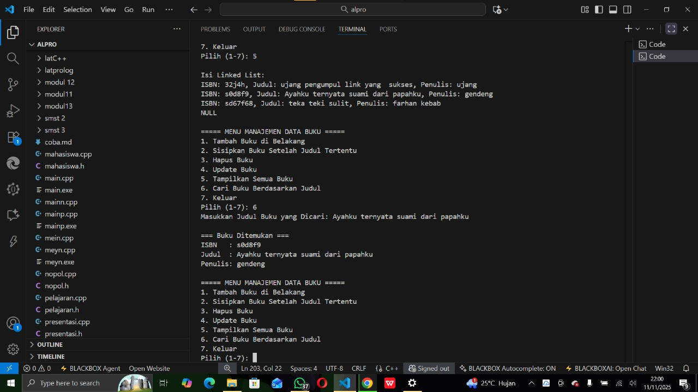
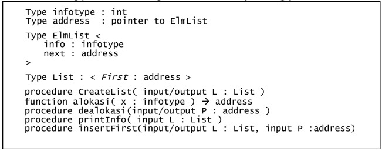
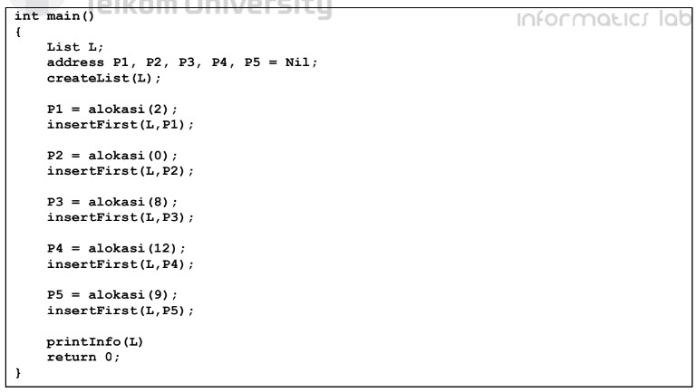
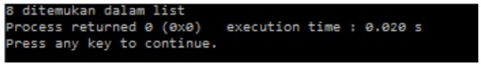
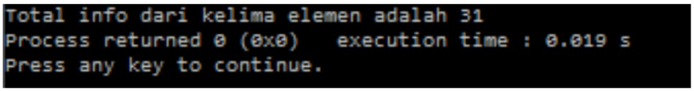

# <h1 align="center">Laporan Praktikum Modul 5 <br> linked list bagian 2 </h1>
<p align="center">Atha Muyassar - 103112430185</p>

## Dasar Teori
Algoritma pencarian (searching), yaitu proses menemukan data tertentu di dalam suatu struktur data seperti array atau list. Algoritma ini bekerja dengan cara membandingkan setiap elemen dalam data dengan nilai yang dicari hingga ditemukan kecocokan. Dua metode yang umum digunakan adalah Sequential Search (Linear Search) dan Binary Search. Sequential Search memeriksa elemen satu per satu dari awal hingga akhir, sedangkan Binary Search hanya dapat digunakan pada data yang telah terurut, dengan membagi data menjadi dua bagian untuk mempersempit pencarian setiap langkahnya. Konsep ini digunakan untuk meningkatkan efisiensi dalam menemukan data yang dibutuhkan pada berbagai aplikasi.

## Guided

### soal 1
Bagian searching pada program ini berfungsi untuk mencari data buku berdasarkan judul di dalam linked list. Prosesnya dimulai dengan memeriksa apakah list kosong. Jika kosong, program akan menampilkan pesan bahwa list tidak berisi data. Jika tidak kosong, pointer temp digunakan untuk menelusuri setiap node dari awal (head) hingga akhir (nullptr). Di setiap langkah, program membandingkan nilai judul dalam node dengan judul yang dicari. Jika ditemukan kecocokan, maka informasi buku seperti ISBN, judul, dan penulis akan ditampilkan di layar, serta program menandai bahwa data telah ditemukan. Namun, bila seluruh list sudah diperiksa dan tidak ada judul yang cocok, program akan menampilkan pesan bahwa buku tidak ditemukan. Dengan cara ini, fungsi searching memastikan pengguna dapat mengetahui apakah buku tertentu tersimpan di dalam list atau tidak.

```go
#include <iostream>
using namespace std;

// Struktur Node
struct Node {
    string isbn, judul, penulis;
    Node* next;
};

// Pointer awal (head dan tail)
Node* head = nullptr;
Node* tail = nullptr;

// Fungsi untuk membuat node baru
Node* createNode(string isbn, string judul, string penulis) {
    Node* newNode = new Node();
    newNode->isbn = isbn;
    newNode->judul = judul;
    newNode->penulis = penulis;
    newNode->next = nullptr;
    return newNode;
}

// ========== INSERT FUNCTION ==========
void insertBelakang(string isbn, string judul, string penulis) {
    Node* newNode = createNode(isbn, judul, penulis);
    if (head == nullptr) {
        head = newNode;
        tail = newNode;
    } else {
        tail->next = newNode;
        tail = newNode;
    }
    cout << "Data \"" << judul << "\" berhasil ditambahkan di belakang.\n";
}

void insertSetelah(string target, string isbn, string judul, string penulis) {
    Node* temp = head;
    while (temp != nullptr && temp->judul != target) {
        temp = temp->next;
    }

    if (temp == nullptr) {
        cout << "Data \"" << target << "\" tidak ditemukan!\n";
    } else {
        Node* newNode = createNode(isbn, judul, penulis);
        newNode->next = temp->next;
        temp->next = newNode;
        if (temp == tail) {
            tail = newNode;
        }
        cout << "Data \"" << judul << "\" berhasil disisipkan setelah \"" << target << "\".\n";
    }
}

// ========== DELETE FUNCTION ==========
void hapusNode(string judul) {
    if (head == nullptr) {
        cout << "List kosong!\n";
        return;
    }

    Node* temp = head;
    Node* prev = nullptr;

    if (temp != nullptr && temp->judul == judul) {
        head = temp->next;
        if (head == nullptr) tail = nullptr;
        delete temp;
        cout << "Data \"" << judul << "\" berhasil dihapus.\n";
        return;
    }

    while (temp != nullptr && temp->judul != judul) {
        prev = temp;
        temp = temp->next;
    }

    if (temp == nullptr) {
        cout << "Data \"" << judul << "\" tidak ditemukan!\n";
        return;
    }

    prev->next = temp->next;
    if (temp == tail) tail = prev;
    delete temp;
    cout << "Data \"" << judul << "\" berhasil dihapus.\n";
}

// ========== UPDATE FUNCTION ==========
void updateNode(string judulLama, string isbnBaru, string judulBaru, string penulisBaru) {
    Node* temp = head;
    while (temp != nullptr && temp->judul != judulLama) {
        temp = temp->next;
    }

    if (temp == nullptr) {
        cout << "Data \"" << judulLama << "\" tidak ditemukan!\n";
    } else {
        temp->isbn = isbnBaru;
        temp->judul = judulBaru;
        temp->penulis = penulisBaru;
        cout << "Data \"" << judulLama << "\" berhasil diupdate menjadi \"" << judulBaru << "\".\n";
    }
}

// ========== SEARCH FUNCTION ==========
void cariBuku(string judulDicari) {
    if (head == nullptr) {
        cout << "List kosong!\n";
        return;
    }

    Node* temp = head;
    bool ditemukan = false;

    while (temp != nullptr) {
        if (temp->judul == judulDicari) {
            cout << "\n=== Buku Ditemukan ===\n";
            cout << "ISBN   : " << temp->isbn << endl;
            cout << "Judul  : " << temp->judul << endl;
            cout << "Penulis: " << temp->penulis << endl;
            ditemukan = true;
            break;
        }
        temp = temp->next;
    }

    if (!ditemukan) {
        cout << "Buku dengan judul \"" << judulDicari << "\" tidak ditemukan!\n";
    }
}

// ========== DISPLAY FUNCTION ==========
void tampilkanList() {
    if (head == nullptr) {
        cout << "List kosong!\n";
        return;
    }
    Node* temp = head;
    cout << "\nIsi Linked List:\n";
    while (temp != nullptr) {
        cout << "ISBN: " << temp->isbn
             << ", Judul: " << temp->judul
             << ", Penulis: " << temp->penulis << endl;
        temp = temp->next;
    }
    cout << "NULL\n";
}

// ========== MAIN PROGRAM ==========
int main() {
    int choice;
    string isbn, judul, penulis, target;
    string judulLama, isbnBaru, judulBaru, penulisBaru;

    do {
        cout << "\n===== MENU MANAJEMEN DATA BUKU =====\n";
        cout << "1. Tambah Buku di Belakang\n";
        cout << "2. Sisipkan Buku Setelah Judul Tertentu\n";
        cout << "3. Hapus Buku\n";
        cout << "4. Update Buku\n";
        cout << "5. Tampilkan Semua Buku\n";
        cout << "6. Cari Buku Berdasarkan Judul\n";
        cout << "7. Keluar\n";
        cout << "Pilih (1-7): ";
        cin >> choice;
        cin.ignore();

        switch (choice) {
            case 1:
                cout << "Masukkan ISBN: ";
                getline(cin, isbn);
                cout << "Masukkan Judul: ";
                getline(cin, judul);
                cout << "Masukkan Penulis: ";
                getline(cin, penulis);
                insertBelakang(isbn, judul, penulis);
                break;
            case 2:
                cout << "Masukkan Judul Target: ";
                getline(cin, target);
                cout << "Masukkan ISBN: ";
                getline(cin, isbn);
                cout << "Masukkan Judul Baru: ";
                getline(cin, judul);
                cout << "Masukkan Penulis Baru: ";
                getline(cin, penulis);
                insertSetelah(target, isbn, judul, penulis);
                break;
            case 3:
                cout << "Masukkan Judul Buku yang Ingin Dihapus: ";
                getline(cin, judul);
                hapusNode(judul);
                break;
            case 4:
                cout << "Masukkan Judul Buku yang Ingin Diupdate: ";
                getline(cin, judulLama);
                cout << "Masukkan ISBN Baru: ";
                getline(cin, isbnBaru);
                cout << "Masukkan Judul Baru: ";
                getline(cin, judulBaru);
                cout << "Masukkan Penulis Baru: ";
                getline(cin, penulisBaru);
                updateNode(judulLama, isbnBaru, judulBaru, penulisBaru);
                break;
            case 5:
                tampilkanList();
                break;
            case 6:
                cout << "Masukkan Judul Buku yang Dicari: ";
                getline(cin, judul);
                cariBuku(judul);
                break;
            case 7:
                cout << "Keluar dari program.\n";
                break;
            default:
                cout << "Pilihan tidak valid! Silakan coba lagi.\n";
        }
    } while (choice != 7);

    return 0;
}
```
>Output
>


## Unguided

### Soal 1
Buatlah ADT Singly Linked list sebagai berikut
> 

Kemudian buat implementasi ADT Singly Linked list pada file “linklist.cpp”.
Adapun isi data
> 

### linklist.h
```go
#ifndef SINGLYLIST_H
#define SINGLYLIST_H

#include <iostream>
using namespace std;

#define Nil NULL

typedef int infotype;
typedef struct ElmList *address;

struct ElmList {
    infotype info;
    address next;
};

struct List {
    address first;
};
```

### linklist.cpp
```go
#include "linklist.h"

void createList(List &L) {
    L.first = Nil;
}

address alokasi(infotype x) {
    address P = new ElmList;
    if (P != Nil) {
        P->info = x;
        P->next = Nil;
    }
    return P;
}

void dealokasi(address P) {
    delete P;
}

void insertFirst(List &L, address P) {
    if (L.first == Nil) {
        L.first = P;
    } else {
        P->next = L.first;
        L.first = P;
    }
}

void printInfo(List L) {
    address P = L.first;
    while (P != Nil) {
        cout << P->info << " ";
        P = P->next;
    }
    cout << endl;
}

address findElm(List L, infotype x) {
    address P = L.first;
    while (P != Nil) {
        if (P->info == x) {
            return P; 
        }
        P = P->next;
    }
    return Nil; 
}

int totalInfo(List L) {
    int total = 0;
    address P = L.first;
    while (P != Nil) {
        total += P->info;
        P = P->next;
    }
    return total;
}
```

### mainp.cpp
```go
#include "linklist.h"

int main() {
    List L;
    address P1, P2, P3, P4, P5 = Nil;

    createList(L);

    P1 = alokasi(2);
    insertFirst(L, P1);

    P2 = alokasi(0);
    insertFirst(L, P2);

    P3 = alokasi(8);
    insertFirst(L, P3);

    P4 = alokasi(12);
    insertFirst(L, P4);

    P5 = alokasi(9);
    insertFirst(L, P5);

    cout << "Isi list: ";
    printInfo(L);

    address hasil = findElm(L, 8);
    if (hasil != Nil)
        cout << "Elemen dengan info 8 ditemukan pada alamat: " << hasil << endl;
    else
        cout << "Elemen dengan info 8 tidak ditemukan." << endl;

    cout << "Total semua nilai elemen: " << totalInfo(L) << endl;

    return 0;
} 
```

> Output
> 

### Soal 2
Carilah elemen dengan info 8 dengan membuat fungsi baru.
fungsi findElm( L : List, x : infotype ) : address
> 

> Output
> 

### Soal 3
Hitunglah jumlah total info seluruh elemen (9+12+8+0+2=31).
> 

> Output
> 

### Kesimpulan
Program di atas merupakan implementasi linked list sederhana dengan fokus pada proses pencarian data (searching). Struktur datanya terdiri dari node yang menyimpan nilai info bertipe integer dan penunjuk next ke elemen berikutnya. Fungsi createList digunakan untuk membuat list kosong, alokasi untuk membuat node baru, dan insertFirst untuk menambahkan node di awal list. Bagian utama pencarian terdapat pada fungsi findElm, yang menelusuri setiap node mulai dari elemen pertama (L.first) menggunakan pointer P. Jika ditemukan node dengan nilai info yang sama dengan nilai yang dicari, fungsi akan mengembalikan alamat node tersebut, sedangkan jika tidak ditemukan hingga akhir list (Nil), fungsi mengembalikan Nil. Dengan cara ini, program dapat memeriksa apakah suatu nilai tertentu terdapat dalam linked list dan menampilkan hasilnya ke layar.

## Referensi
