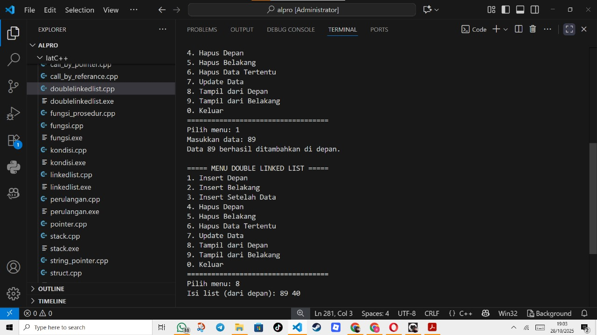
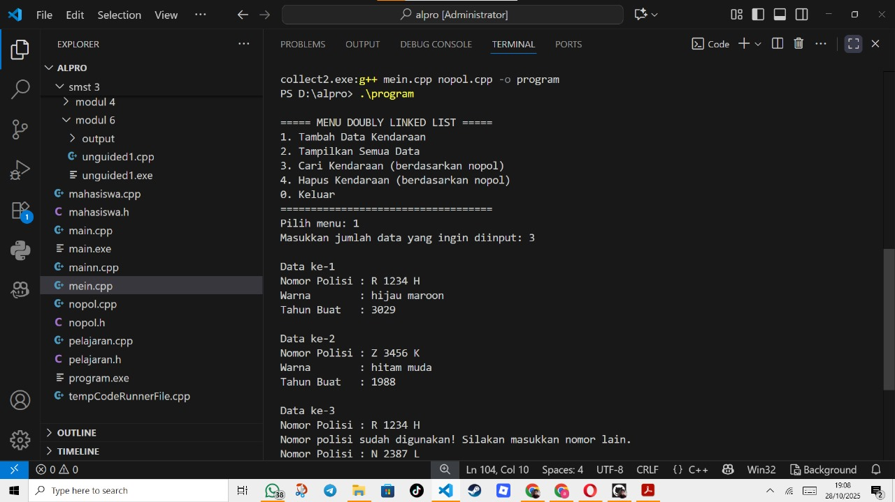
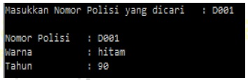
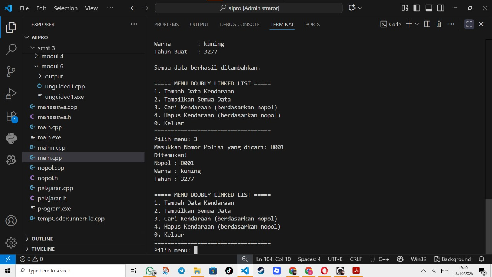
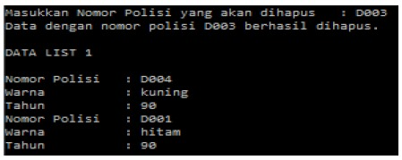
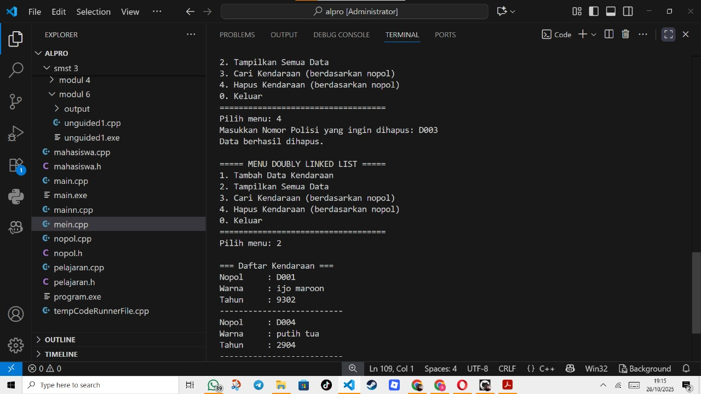

# <h1 align="center">Laporan Praktikum Modul 6 <br> Doubly linked list bagian 1 </h1>
<p align="center">Atha Muyassar - 103112430185</p>

## Dasar Teori


## Guided

### soal 1
Program ini digunakan untuk menyimpan, menambah, menghapus, mengubah, dan menampilkan data bertipe bilangan bulat secara dinamis. Setiap simpul atau node memiliki tiga komponen utama: data, pointer ke node sebelumnya (prev), dan pointer ke node berikutnya (next), sehingga memungkinkan penelusuran dua arah — baik dari depan maupun dari belakang. Program ini juga menerapkan berbagai operasi penting seperti penyisipan di depan dan belakang, penyisipan setelah elemen tertentu, penghapusan berdasarkan posisi atau nilai, serta pembaruan (update) data. Selain itu, pengguna dapat menampilkan isi list dari dua arah sesuai kebutuhan. Melalui menu interaktif di fungsi main(), pengguna dapat memilih operasi yang diinginkan dengan mudah. Secara keseluruhan, program ini menunjukkan penerapan konsep manajemen memori dinamis, pointer ganda, dan modularitas fungsi dalam pengelolaan data berstruktur menggunakan bahasa pemrograman C++.

```go
#include <iostream>
using namespace std;

struct Node {
    int data;
    Node* prev;
    Node* next;
};

Node* head = nullptr;
Node* tail = nullptr;

// ================================
// Fungsi Insert di Depan
// ================================
void insertDepan(int data) {
    Node* newNode = new Node();
    newNode->data = data;
    newNode->prev = nullptr;
    newNode->next = head;

    if (head != nullptr)
        head->prev = newNode;
    else
        tail = newNode;

    head = newNode;
    cout << "Data " << data << " berhasil ditambahkan di depan.\n";
}

// ================================
// Fungsi Insert di Belakang
// ================================
void insertBelakang(int data) {
    Node* newNode = new Node();
    newNode->data = data;
    newNode->next = nullptr;
    newNode->prev = tail;

    if (tail != nullptr)
        tail->next = newNode;
    else
        head = newNode;

    tail = newNode;
    cout << "Data " << data << " berhasil ditambahkan di belakang.\n";
}

// ================================
// Fungsi Insert Setelah Data
// ================================
void insertSetelah(int target, int data) {
    Node* current = head;
    while (current != nullptr && current->data != target)
        current = current->next;

    if (current == nullptr) {
        cout << "Data " << target << " tidak ditemukan.\n";
        return;
    }

    Node* newNode = new Node();
    newNode->data = data;
    newNode->next = current->next;
    newNode->prev = current;

    if (current->next != nullptr)
        current->next->prev = newNode;
    else
        tail = newNode;

    current->next = newNode;
    cout << "Data " << data << " berhasil disisipkan setelah " << target << ".\n";
}

// ================================
// Fungsi Hapus Depan
// ================================
void hapusDepan() {
    if (head == nullptr) {
        cout << "List kosong, tidak ada yang dihapus.\n";
        return;
    }

    Node* temp = head;
    head = head->next;

    if (head != nullptr)
        head->prev = nullptr;
    else
        tail = nullptr;

    cout << "Data " << temp->data << " di depan berhasil dihapus.\n";
    delete temp;
}

// ================================
// Fungsi Hapus Belakang
// ================================
void hapusBelakang() {
    if (tail == nullptr) {
        cout << "List kosong, tidak ada yang dihapus.\n";
        return;
    }

    Node* temp = tail;
    tail = tail->prev;

    if (tail != nullptr)
        tail->next = nullptr;
    else
        head = nullptr;

    cout << "Data " << temp->data << " di belakang berhasil dihapus.\n";
    delete temp;
}

// ================================
// Fungsi Hapus Data Tertentu
// ================================
void hapusData(int target) {
    if (head == nullptr) {
        cout << "List kosong, tidak ada yang dihapus.\n";
        return;
    }

    Node* current = head;
    while (current != nullptr && current->data != target)
        current = current->next;

    if (current == nullptr) {
        cout << "Data " << target << " tidak ditemukan.\n";
        return;
    }

    if (current->prev != nullptr)
        current->prev->next = current->next;
    else
        head = current->next;

    if (current->next != nullptr)
        current->next->prev = current->prev;
    else
        tail = current->prev;

    cout << "Data " << target << " berhasil dihapus.\n";
    delete current;
}

// ================================
// Fungsi Update Data
// ================================
void updateData(int oldData, int newData) {
    if (head == nullptr) {
        cout << "List kosong, tidak ada data untuk diupdate.\n";
        return;
    }

    Node* current = head;
    while (current != nullptr && current->data != oldData)
        current = current->next;

    if (current == nullptr) {
        cout << "Data " << oldData << " tidak ditemukan.\n";
        return;
    }

    current->data = newData;
    cout << "Data " << oldData << " berhasil diupdate menjadi " << newData << ".\n";
}

// ================================
// Fungsi Tampil dari Depan
// ================================
void tampilDepan() {
    if (head == nullptr) {
        cout << "List kosong.\n";
        return;
    }

    cout << "Isi list (dari depan): ";
    Node* current = head;
    while (current != nullptr) {
        cout << current->data << " ";
        current = current->next;
    }
    cout << "\n";
}

// ================================
// Fungsi Tampil dari Belakang
// ================================
void tampilBelakang() {
    if (tail == nullptr) {
        cout << "List kosong.\n";
        return;
    }

    cout << "Isi list (dari belakang): ";
    Node* current = tail;
    while (current != nullptr) {
        cout << current->data << " ";
        current = current->prev;
    }
    cout << "\n";
}

// ================================
// MAIN PROGRAM (Menu Interaktif)
// ================================
int main() {
    int pilihan, data, target, oldData, newData;

    do {
        cout << "\n===== MENU DOUBLE LINKED LIST =====\n";
        cout << "1. Insert Depan\n";
        cout << "2. Insert Belakang\n";
        cout << "3. Insert Setelah Data\n";
        cout << "4. Hapus Depan\n";
        cout << "5. Hapus Belakang\n";
        cout << "6. Hapus Data Tertentu\n";
        cout << "7. Update Data\n";
        cout << "8. Tampil dari Depan\n";
        cout << "9. Tampil dari Belakang\n";
        cout << "0. Keluar\n";
        cout << "===================================\n";
        cout << "Pilih menu: ";
        cin >> pilihan;

        switch (pilihan) {
            case 1:
                cout << "Masukkan data: ";
                cin >> data;
                insertDepan(data);
                break;
            case 2:
                cout << "Masukkan data: ";
                cin >> data;
                insertBelakang(data);
                break;
            case 3:
                cout << "Masukkan data target: ";
                cin >> target;
                cout << "Masukkan data baru: ";
                cin >> data;
                insertSetelah(target, data);
                break;
            case 4:
                hapusDepan();
                break;
            case 5:
                hapusBelakang();
                break;
            case 6:
                cout << "Masukkan data yang ingin dihapus: ";
                cin >> target;
                hapusData(target);
                break;
            case 7:
                cout << "Masukkan data lama: ";
                cin >> oldData;
                cout << "Masukkan data baru: ";
                cin >> newData;
                updateData(oldData, newData);
                break;
            case 8:
                tampilDepan();
                break;
            case 9:
                tampilBelakang();
                break;
            case 0:
                cout << "Keluar dari program.\n";
                break;
            default:
                cout << "Pilihan tidak valid.\n";
        }
    } while (pilihan != 0);

    return 0;
} 
```
>Output
>


## Unguided

### Soal 1
Buatlah implementasi ADT Doubly Linked list pada file “nopol.cpp” dan coba hasil
implementasi ADT pada file “mein.cpp”.

### nopol.h
```go
#ifndef NOPOL_H
#define NOPOL_H

#include <iostream>
using namespace std;

struct Kendaraan {
    char nopol[50];
    char warna[50];
    int thnBuat;
};

struct ElmList {
    Kendaraan info;
    ElmList* next;
    ElmList* prev;
};

struct List {
    ElmList* first;
    ElmList* last;
};

void createList(List &L);
ElmList* alokasi(Kendaraan x);
void dealokasi(ElmList* &P);
void insertLast(List &L, ElmList* P);
ElmList* findElm(List L, char nopol[]);
void printInfo(List L);
void deleteFirst(List &L, ElmList* &P);
void deleteLast(List &L, ElmList* &P);
void deleteAfter(ElmList* Prec, ElmList* &P);

#endif
```

### nopol.cpp
```go
#include "nopol.h"

void createList(List &L) {
    L.first = nullptr;
    L.last = nullptr;
}

ElmList* alokasi(Kendaraan x) {
    ElmList* P = new ElmList;
    P->info = x;
    P->next = nullptr;
    P->prev = nullptr;
    return P;
}

void dealokasi(ElmList* &P) {
    delete P;
    P = nullptr;
}

void insertLast(List &L, ElmList* P) {
    if (L.first == nullptr) {
        L.first = P;
        L.last = P;
    } else {
        L.last->next = P;
        P->prev = L.last;
        L.last = P;
    }
}

ElmList* findElm(List L, char nopol[]) {
    ElmList* P = L.first;
    while (P != nullptr) {
        int sama = 1;
        for (int i = 0; ; i++) {
            if (P->info.nopol[i] != nopol[i]) {
                sama = 0;
                break;
            }
            if (P->info.nopol[i] == '\0' && nopol[i] == '\0') break;
        }
        if (sama) return P;
        P = P->next;
    }
    return nullptr;
}

void printInfo(List L) {
    if (L.first == nullptr) {
        cout << "List kosong.\n";
        return;
    }
    ElmList* P = L.first;
    cout << "\n=== Daftar Kendaraan ===\n";
    while (P != nullptr) {
        cout << "Nopol     : " << P->info.nopol << endl;
        cout << "Warna     : " << P->info.warna << endl;
        cout << "Tahun     : " << P->info.thnBuat << endl;
        cout << "--------------------------\n";
        P = P->next;
    }
}

void deleteFirst(List &L, ElmList* &P) {
    if (L.first == nullptr) {
        P = nullptr;
    } else if (L.first == L.last) {
        P = L.first;
        L.first = nullptr;
        L.last = nullptr;
    } else {
        P = L.first;
        L.first = L.first->next;
        L.first->prev = nullptr;
        P->next = nullptr;
    }
}

void deleteLast(List &L, ElmList* &P) {
    if (L.first == nullptr) {
        P = nullptr;
    } else if (L.first == L.last) {
        P = L.last;
        L.first = nullptr;
        L.last = nullptr;
    } else {
        P = L.last;
        L.last = L.last->prev;
        L.last->next = nullptr;
        P->prev = nullptr;
    }
}

void deleteAfter(ElmList* Prec, ElmList* &P) {
    if (Prec == nullptr || Prec->next == nullptr) {
        P = nullptr;
    } else {
        P = Prec->next;
        Prec->next = P->next;
        if (P->next != nullptr) {
            P->next->prev = Prec;
        }
        P->next = nullptr;
        P->prev = nullptr;
    }
}
```

### mein.cpp
```go
#include "nopol.h"

int main() {
    List L;
    createList(L);

    int pilihan;
    char cari[50];

    do {
        cout << "\n===== MENU DOUBLY LINKED LIST =====\n";
        cout << "1. Tambah Data Kendaraan\n";
        cout << "2. Tampilkan Semua Data\n";
        cout << "3. Cari Kendaraan (berdasarkan nopol)\n";
        cout << "4. Hapus Kendaraan (berdasarkan nopol)\n";
        cout << "0. Keluar\n";
        cout << "===================================\n";
        cout << "Pilih menu: ";
        cin >> pilihan;
        cin.ignore();

        switch (pilihan) {
            case 1: {
                int jumlah;
                cout << "Masukkan jumlah data yang ingin diinput: ";
                cin >> jumlah;
                cin.ignore();

                for (int i = 0; i < jumlah; i++) {
                    Kendaraan k;
                    cout << "\nData ke-" << i + 1 << endl;

                    int valid = 0;
                    while (!valid) {
                        cout << "Nomor Polisi : ";
                        cin.getline(k.nopol, 50);
                        if (findElm(L, k.nopol) != nullptr) {
                            cout << "Nomor polisi sudah digunakan! Silakan masukkan nomor lain.\n";
                        } else {
                            valid = 1;
                        }
                    }

                    cout << "Warna        : ";
                    cin.getline(k.warna, 50);
                    cout << "Tahun Buat   : ";
                    cin >> k.thnBuat;
                    cin.ignore();

                    insertLast(L, alokasi(k));
                }
                cout << "\nSemua data berhasil ditambahkan.\n";
                break;
            }

            case 2:
                printInfo(L);
                break;

            case 3:
                cout << "Masukkan Nomor Polisi yang dicari: ";
                cin.getline(cari, 50);
                {
                    ElmList* found = findElm(L, cari);
                    if (found != nullptr) {
                        cout << "Ditemukan!\n";
                        cout << "Nopol : " << found->info.nopol << endl;
                        cout << "Warna : " << found->info.warna << endl;
                        cout << "Tahun : " << found->info.thnBuat << endl;
                    } else {
                        cout << "Data tidak ditemukan.\n";
                    }
                }
                break;

            case 4:
                cout << "Masukkan Nomor Polisi yang ingin dihapus: ";
                cin.getline(cari, 50);
                {
                    ElmList* del = findElm(L, cari);
                    if (del != nullptr) {
                        if (del == L.first)
                            deleteFirst(L, del);
                        else if (del == L.last)
                            deleteLast(L, del);
                        else {
                            ElmList* prec = del->prev;
                            deleteAfter(prec, del);
                        }
                        dealokasi(del);
                        cout << "Data berhasil dihapus.\n";
                    } else {
                        cout << "Data tidak ditemukan.\n";
                    }
                }
                break;

            case 0:
                cout << "Program selesai.\n";
                break;

            default:
                cout << "Pilihan tidak valid!\n";
        }
    } while (pilihan != 0);

    return 0;
}
```

> Output
> 

### Soal 2
Carilah elemen dengan nomor polisi D001 dengan membuat fungsi baru.
fungsi findElm( L : List, x : infotype ) : address
> 

> Output
> 

### Soal 3
Hapus elemen dengan nomor polisi D003 dengan procedure delete.
- procedure deleteFirst( input/output L : List,
P : address )
- procedure deleteLast( input/output L : List,
P : address )
- procedure deleteAfter( input Prec : address,
input/output P : address )
> 

> Output
> 

### Kesimpulan
Kesimpulan dari program di atas adalah bahwa kode tersebut merupakan implementasi struktur data Doubly Linked List untuk menyimpan, menampilkan, mencari, dan menghapus data kendaraan berdasarkan nomor polisi (nopol). Program ini menggunakan pendekatan abstraksi data dengan memisahkan deklarasi struktur dan fungsi ke dalam file header (nopol.h), implementasi logika ke dalam file (nopol.cpp), serta program utama yang berinteraksi dengan pengguna pada file (mein.cpp). Melalui menu interaktif, pengguna dapat menambah data kendaraan dengan validasi agar nomor polisi tidak ganda, menampilkan seluruh daftar kendaraan, mencari data tertentu, dan menghapus data sesuai nomor polisi yang dimasukkan. Penggunaan doubly linked list memberikan efisiensi dalam navigasi data karena setiap node memiliki dua penunjuk—ke depan (next) dan ke belakang (prev)—sehingga proses penelusuran dan penghapusan data dapat dilakukan dengan lebih fleksibel. Secara keseluruhan, program ini menunjukkan penerapan konsep ADT (Abstract Data Type) dan manajemen memori dinamis dalam pemrograman berorientasi prosedural menggunakan C++.

## Referensi

1. https://www.geeksforgeeks.org/dsa/doubly-linked-list/
2. https://www.tutorialspoint.com/data_structures_algorithms/doubly_linked_list_algorithm.htm
3. https://www.cs.odu.edu/~zeil/cs330/latest/Public/implementingADTS/index.html
4. https://www.geeksforgeeks.org/dsa/abstract-data-types/

