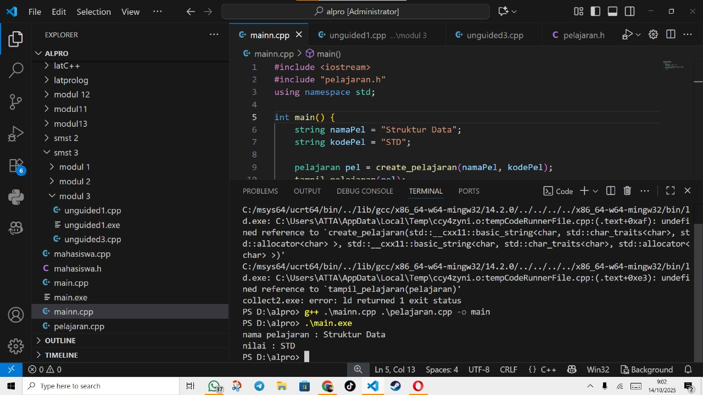
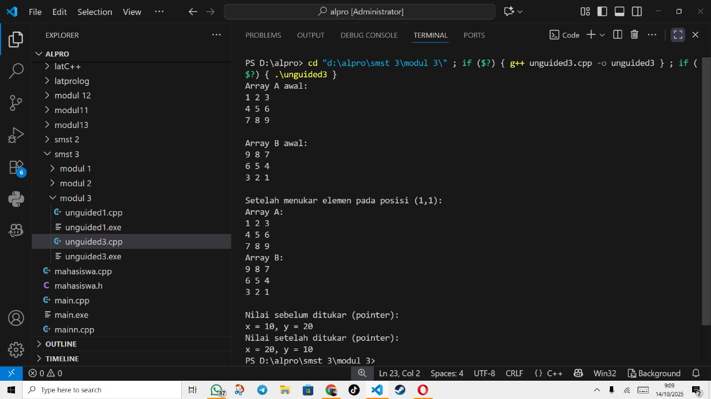

# <h1 align="center">Laporan Praktikum Modul 3 <br> Abstract data type </h1>
<p align="center">Atha Muyassar - 103112430185</p>

## Dasar Teori

Array 2 dimensi adalah struktur data yang digunakan untuk menyimpan sekumpulan data dalam bentuk baris dan kolom sehingga menyerupai tabel atau matriks, di mana setiap elemennya diakses dengan indeks [baris][kolom] dan banyak digunakan untuk merepresentasikan data berbentuk grid, seperti matriks matematika, papan permainan, atau citra digital. Dalam pemanggilan fungsi, terdapat dua konsep penting yaitu call by pointer dan call by reference. Call by pointer adalah mekanisme di C/C++ di mana alamat memori suatu variabel dikirim ke fungsi menggunakan pointer sehingga fungsi dapat langsung mengubah nilai asli dari variabel tersebut dengan memanfaatkan operator * (dereferensi) dan & (alamat). Sementara itu, call by reference adalah mekanisme khusus di C++ yang mirip dengan call by pointer, tetapi lebih sederhana karena menggunakan tanda & pada parameter fungsi, sehingga variabel yang dikirim tidak disalin melainkan dirujuk secara langsung, membuat perubahan dalam fungsi juga berpengaruh pada variabel aslinya tanpa perlu menggunakan operator dereferensi. 

## Guided

### soal 1 (Call by pointer)

Program ini digunakan untuk menukar nilai dua variabel dengan menggunakan pointer. Fungsi tukar memanfaatkan alamat memori (&a dan &b) sehingga perubahan yang dilakukan di dalam fungsi langsung memengaruhi nilai variabel aslinya. Dengan cara ini, nilai a dan b berhasil ditukar tanpa perlu mengembalikan nilai dari fungsi.
### mahasiswa.cpp
```go
#include "mahasiswa.h"
#include <iostream>
using namespace std;

void inputMhs(mahasiswa &m)
{
    cout << "Masukan nama: ";
    cin >> (m).nim;
    cout << "Masukkan nilai 1: ";
    cin >> (m).nilai1;
    cout << "Masukkan nilai 2: ";
    cin >> (m).nilai2;
}
float rata2(mahasiswa m)
{
    return (m.nilai1 + m.nilai2) / 2;
}
```
### mahasiswa.h
```go
#ifndef MAHASISWA_H_INCLUDED
#define MAHASISWA_H_INCLUDED
struct mahasiswa
{
    char nim[10];
    int nilai1, nilai2;
};
void inputMhs(mahasiswa &m);
float rata2(mahasiswa m);
#endif
```
### main.cpp
```go
#include <iostream>
#include "mahasiswa.h"
using namespace std;

int main()
{
    mahasiswa mhs;
    inputMhs(mhs);
    cout << "rata-rata= " << rata2(mhs) << endl;
    return 0;
}
```
>Output
>

## Unguided

### Soal 1
Buatlah sebuah program untuk melakukan transpose pada sebuah matriks persegi berukuran 3x3. Operasi transpose adalah mengubah baris menjadi kolom dan sebaliknya. Inisialisasi matriks awal di dalam kode, kemudian buat logika untuk melakukan transpose dan simpan hasilnya ke dalam matriks baru. Terakhir, tampilkan matriks awal dan matriks hasil transpose.
Contoh Output:
>

```go
#include <iostream>
#include <iomanip>
using namespace std;

struct Mahasiswa {
    string nama;
    string nim;
    float uts;
    float uas;
    float tugas;
    float nilaiAkhir;
};

float hitungNilaiAkhir(float uts, float uas, float tugas) {
    return 0.3 * uts + 0.4 * uas + 0.3 * tugas;
}

int main() {
    Mahasiswa mhs[10];
    int jumlah;

    cout << "Masukkan jumlah mahasiswa (maks 10): ";
    cin >> jumlah;

    for (int i = 0; i < jumlah; i++) {
        cout << "\nMahasiswa ke-" << i + 1 << endl;
        cout << "Nama   : ";
        cin >> mhs[i].nama;
        cout << "NIM (maks 12 angka): ";
        cin >> mhs[i].nim;
        cout << "Nilai UTS   : ";
        cin >> mhs[i].uts;
        cout << "Nilai UAS   : ";
        cin >> mhs[i].uas;
        cout << "Nilai Tugas : ";
        cin >> mhs[i].tugas;

        mhs[i].nilaiAkhir = hitungNilaiAkhir(mhs[i].uts, mhs[i].uas, mhs[i].tugas);
    }

    cout << "\nData Mahasiswa:\n";
    cout << left;
    cout << setw(15) << "Nama"
         << setw(15) << "NIM"
         << setw(10) << "UTS"
         << setw(10) << "UAS"
         << setw(10) << "Tugas"
         << setw(12) << "Nilai Akhir" << endl;
    cout << string(72, '-') << endl;

    for (int i = 0; i < jumlah; i++) {
        cout << left
             << setw(15) << mhs[i].nama
             << setw(15) << mhs[i].nim.substr(0, 12) 
             << setw(10) << mhs[i].uts
             << setw(10) << mhs[i].uas
             << setw(10) << mhs[i].tugas
             << setw(12) << fixed << setprecision(1) << mhs[i].nilaiAkhir
             << endl;
    }
    return 0;
}
```

> Output
> 

Program ini digunakan untuk melakukan transpose matriks berukuran 3x3, yaitu menukar baris menjadi kolom dan kolom menjadi baris. Proses ini dilakukan dengan memanfaatkan array 2 dimensi dan perulangan bersarang (for di dalam for).

### Soal 2
Buatlah program yang menunjukkan penggunaan call by reference. Buat sebuah prosedur bernama kuadratkan yang menerima satu parameter integer secara referensi (&). Prosedur ini akan mengubah nilai asli variabel yang dilewatkan dengan nilai kuadratnya. Tampilkan nilai variabel di main() sebelum dan sesudah memanggil prosedur untuk membuktikan perubahannya. 

### pelajaran.h
```go
#ifndef PELAJARAN_H
#define PELAJARAN_H
#include <string>
using namespace std;

struct pelajaran {
    string namaMapel;
    string kodeMapel;
};

pelajaran create_pelajaran(string namaPel, string kodePel);
void tampil_pelajaran(pelajaran pel);

#endif
```
### pelajaran.cpp
```go
#include <iostream>
#include "pelajaran.h"
using namespace std;

pelajaran create_pelajaran(string namaPel, string kodePel) {
    pelajaran p;
    p.namaMapel = namaPel;
    p.kodeMapel = kodePel;
    return p;
}

void tampil_pelajaran(pelajaran pel) {
    cout << "nama pelajaran : " << pel.namaMapel << endl;
    cout << "nilai : " << pel.kodeMapel << endl;
}
```
### mainn.cpp
```go
#include <iostream>
#include "pelajaran.h"
using namespace std;

int main() {
    string namaPel = "Struktur Data";
    string kodePel = "STD";

    pelajaran pel = create_pelajaran(namaPel, kodePel);
    tampil_pelajaran(pel);

    return 0;
}
```

> Output
> 

Program ini digunakan untuk menghitung kuadrat dari sebuah bilangan dengan memanfaatkan fungsi yang menggunakan parameter referensi. Dengan cara ini, variabel asli langsung dimodifikasi di dalam fungsi tanpa perlu mengembalikan nilai.

### Soal 3
Buatlah program yang menunjukkan penggunaan call by reference. Buat sebuah prosedur bernama kuadratkan yang menerima satu parameter integer secara referensi (&). Prosedur ini akan mengubah nilai asli variabel yang dilewatkan dengan nilai kuadratnya. Tampilkan nilai variabel di main() sebelum dan sesudah memanggil prosedur untuk membuktikan perubahannya. 

Contoh Output:

Nilai awal: 5

Nilai setelah dikuadratkan: 25
```go
#include <iostream>
using namespace std;

void tampilArray(int arr[3][3]) {
    for (int i = 0; i < 3; i++) {
        for (int j = 0; j < 3; j++) {
            cout << arr[i][j] << " ";
        }
        cout << endl;
    }
}

void tukarElemen(int A[3][3], int B[3][3], int baris, int kolom) {
    int temp = A[baris][kolom];
    A[baris][kolom] = B[baris][kolom];
    B[baris][kolom] = temp;
}

void tukarPointer(int *x, int *y) {
    int temp = *x;
    *x = *y;
    *y = temp;
}

int main() {
    int A[3][3] = {{1,2,3},{4,5,6},{7,8,9}};
    int B[3][3] = {{9,8,7},{6,5,4},{3,2,1}};
    
    cout << "Array A awal:\n";
    tampilArray(A);
    cout << "\nArray B awal:\n";
    tampilArray(B);

    cout << "\nSetelah menukar elemen pada posisi (1,1):\n";
    tukarElemen(A, B, 1, 1); 
    
    cout << "Array A:\n";
    tampilArray(A);
    cout << "Array B:\n";
    tampilArray(B);

    int x = 10, y = 20;
    cout << "\nNilai sebelum ditukar (pointer):\n";
    cout << "x = " << x << ", y = " << y << endl;

    tukarPointer(&x, &y);

    cout << "Nilai setelah ditukar (pointer):\n";
    cout << "x = " << x << ", y = " << y << endl;

    return 0;
}
```

> Output
> 

Program ini digunakan untuk menghitung kuadrat dari sebuah bilangan dengan memanfaatkan fungsi yang menggunakan parameter referensi. Dengan cara ini, variabel asli langsung dimodifikasi di dalam fungsi tanpa perlu mengembalikan nilai.

## Referensi

1. https://www.w3schools.com/cpp/cpp_arrays_multi.asp
2. https://www.w3schools.com/cpp/cpp_pointers.asp
3. https://www.w3schools.com/cpp/cpp_references.asp
4. https://www.belajarcpp.com/tutorial/cpp/multidimensional-array/
5. https://www.belajarcpp.com/tutorial/cpp/pointer/
6. https://www.belajarcpp.com/tutorial/cpp/reference/
